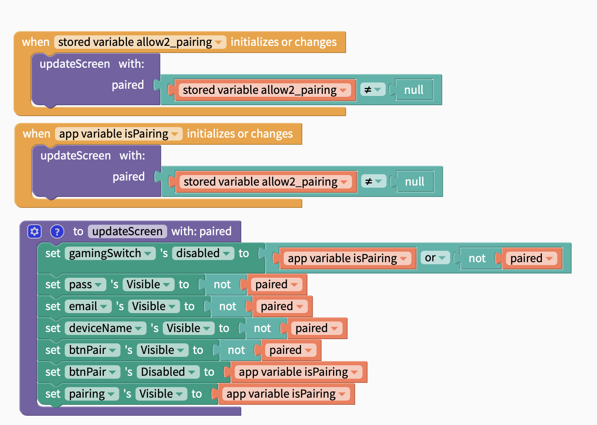
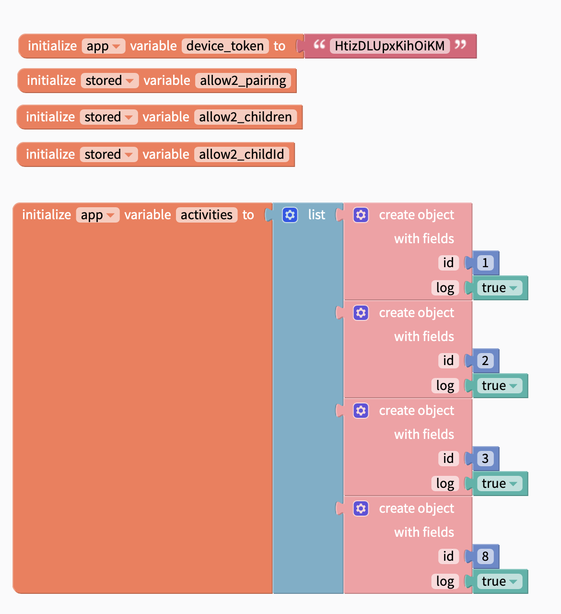
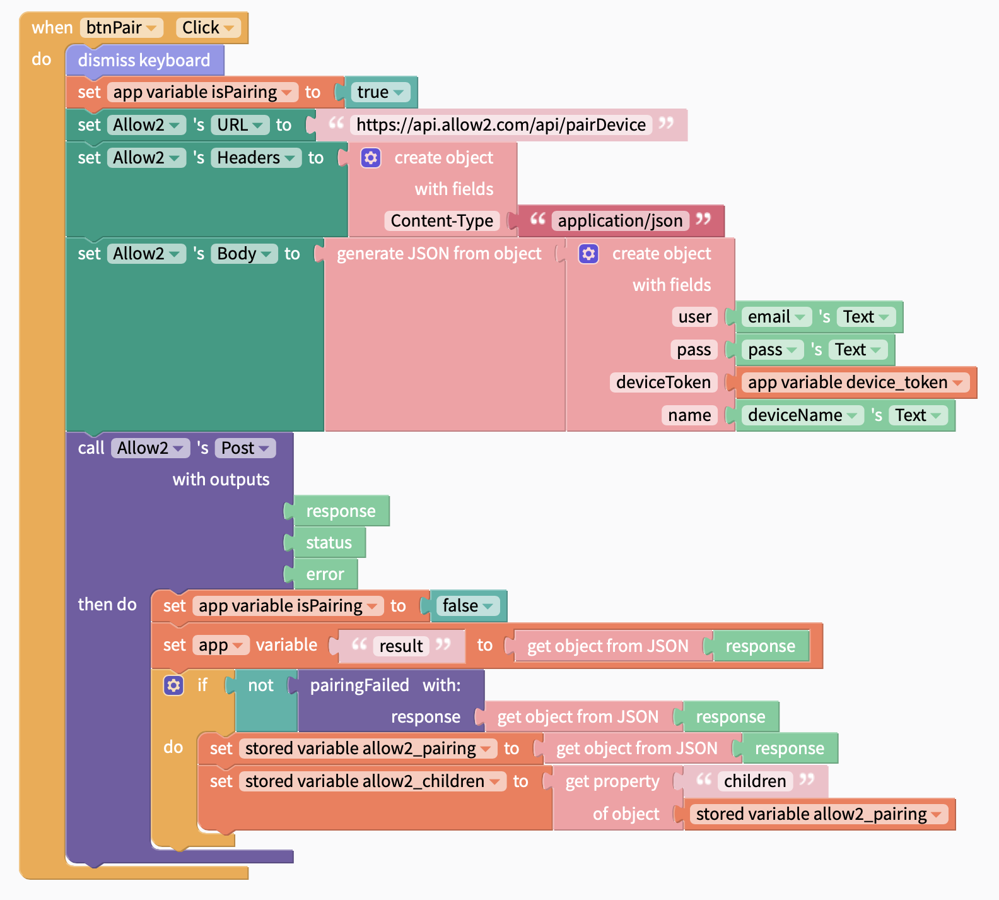
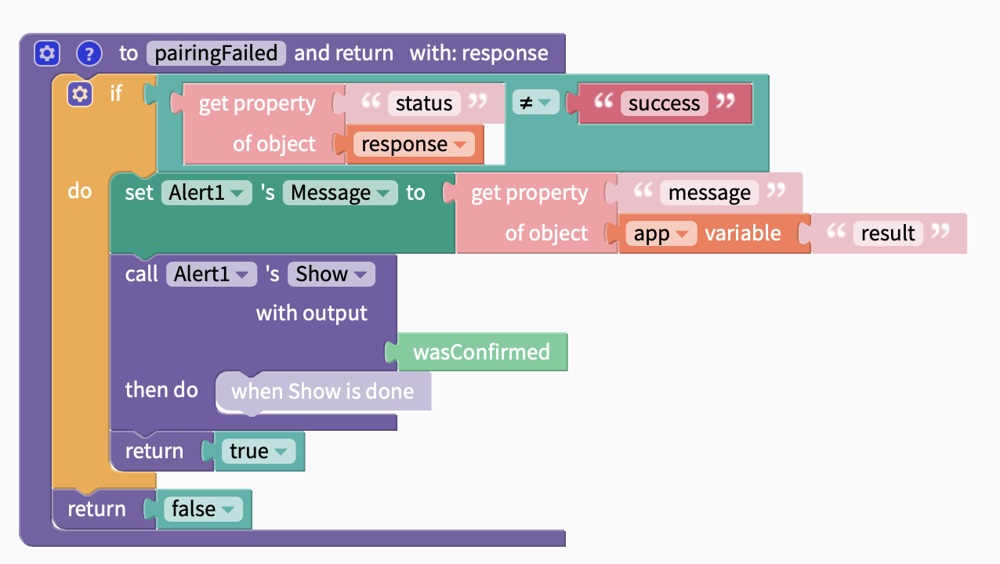

# Thunkable + Allow2

Instructions on using Allow2 to add Parental Freedom to your Thunkable app. https://x.thunkable.com/signup?referrerId=allow2

These instructions are also available as a public (remixable) example app here: https://x.thunkable.com/projectPage/60a898bab06e1600125e0191

## Step 1: Pairing

As with all Allow2 implementations, the app user (or parent) needs to opt-in to Parental Freedom by "pairing" the app with the platform.

To do this, you need to give an option, perhaps in settings for "Parental Freedom", which will allow the parent to open a pairing setup dialog or screen.

Then set up some blocks to react to data changes (such as calling the pairting API and when the device is "paired")

And we need some storage for successful pairings. The pairing should be done once and you should not be able to pair again unless the app is "released" by the parent
on the portal, so we use a local device storage option to persist the data, NOT a cloud storage as each device should be paired independently.

Note also that the device token value needs to be set by using YOUR app device token. You create one at https://developer.allow2.com

Note the variable containing the activity settings, check the Allow2 documentation to choose the right activities you believe should be under control/tracked/quota-managed.
These map to Internet, Screen Time, Gaming and Device Time. ie: using this app really does mean they are in front of a screen, are using internet, are playing a game, etc.

Then we need to have a pairing routine. This simple hits the REST API for Allow2 and tries to pair the device.
On success it persists the pairing details and the list of children. You really should "choose" a child also out of this list and persist the ID to lock the app to a child, but the device
may be shared, in which case it's fine to not lock it to a specific child. They can "log in" using their PIN to choose their profile on a shared device when they open it (if you use
that method):

Note the conditional on error, this is not a complete implementation, you should cater for network errors/etc as you normally would, but if we get a correct response, it may be an "error" (such as incorrect password), so that routine will instead show an error, you can do that however is relevant for your device.

## Step 2: Status checks

Allow2 is designed to only be unpaired (disconnected) by the parent via the portal. Also, for shared devices, parents may add or remove children, or parents or children may change PINs for access. For these reasons, once an app is paired, you should poll Allow2 for status info on a "regular" basis (perhaps every few minutes, up to you).

This timer should be running constantly, it polls the Allow2 service and check if the device/app is still paired, and what children are on the account.

If the service says it's no longer paired, you delete the cached pairing info, children, etc. Then the app is back in the original state and can be paired with a new Allow2 account.

If it still says it's active, you just persist the current child list to make sure you have the latest up-to-date information in case the children can use their accounts on that device.

**EXAMPLE COMING SOON**

## Step 3: Checking/Logging Usage

With a paired device or app, you can lock out certain functions based on the childs access or remaining quota at that time. For instance, maybe if they have screen time, they can view the leaderboard, and if they have messaging quota, can still message friends. But they may be out of game time, so they cannot start a new game. Or you can choose to just make them not able to do anything if they ran out of game quota.

Remember, the purpose is NOT to limit people using your app, the idea is to give controls to parents who will simply NOT allow their children to use the app at all unless they have some freedom to do so (Allow2 provides that parental freedom). So HOW you surface that in your app is up to you.

We recommend you use the power of the Allow2 platform to give children the BEST experience, so for instance, allow children limited access if it makes sense, such as viewing stats, talking to friends, customising characters, etc if they don't have game time, but have screen time. Maybe also, if you are checking for allowed time in the middle of a game, give the child some warning and some grace time, or better still offer a choice to pause at that time, or surface a way of getting to a safe point before kicking them out of the actual game portion.

What you want to do is give the parents a smooth ride. If you can avoid "drawing bad attention" to your app, more and more parents will love you and refer you to other parents. After all, that's the best outcome right? More users?

So, bearing that in mind, once an app is paired with Allow2, the flow is simple. Either you know the child using it (as it's "fixed") or you present a "login" screen for allow2 that let's them pick their name and enter a 4 digit pin. Then they are the current child on the app.

When you want to check for usage or log usage (check to see if they can do something BEFORE they actually start - such as enabling a "New Game" button, or they are playing the game now, so you need to LOG usage), then you use the check API call (with log=false or true).

**EXAMPLE COMING SOON**
