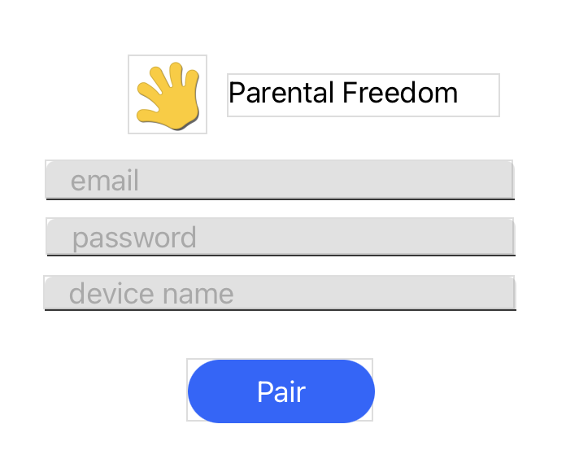

# thunkable
Instructions on using Allow2 to add Parental Freedom to your Thunkable app. https://thunkable.com

These instructions are also available as a public (remixable) example app here: https://x.thunkable.com/projects/60a50360a2ce930011586261

## Step 1: Pairing

As with all Allow2 implementations, the app user (or parent) needs to opt-in to Parental Freedom by "pairing" the app with the platform.

To do this, you need to give an option, perhaps in settings for "Parental Freedom", which will allow the parent to open a pairing setup dialog or screen.

Then set up some blocks to react to data changes (such as calling the pairting API and when the device is "paired")

And we need some storage for successful pairings. The pairing should be done once and you should not be able to pair again unless the app is "released" by the parent
on the portal, so we use a local device storage option to persist the data, NOT a cloud storage as each device should be paired independently.

Note also that the device token value needs to be set by using YOUR app device token. You create one at https://developer.allow2.com

Note the variable containing the activity settings, check the Allow2 documentation to choose the right activities you believe should be under control/tracked/quota-managed.
These map to Internet, Screen Time, Gaming and Device Time. ie: using this app really does mean they are in front of a screen, are using internet, are playing a game, etc.

Then we need to have a pairing routine. This simple hits the REST API for Allow2 and tries to pair the device.
On success it persists the pairing details and the list of children. You really should "choose" a child also out of this list and persist the ID to lock the app to a child, but the device
may be shared, in which case it's fine to not lock it to a specific child. They can "log in" using their PIN to choose their profile on a shared device when they open it (if you use
that method):

Note the conditional on error, this is not a complete implementation, you should cater for network errors/etc as you normally would, but if we get a correct response, it may be an "error" (such as incorrect password), so that routine will instead show an error, you can do that however is relevant for your device.

